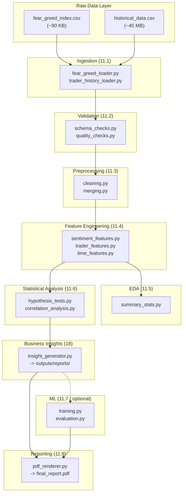

# Architecture Documentation
## Repository: bitcoin-sentiment-trader-performance
### Documentation Standards

---

## 1. System Overview

This repository implements a **production-grade quantitative research pipeline** with strict separation of concerns across eight pipeline stages. The architecture is designed for reproducibility (same raw data + config + code → same output), modularity (each stage is independently executable and testable), and auditability (every derived artifact traces back to its source).

The system answers whether Bitcoin Fear & Greed sentiment measurably influences Hyperliquid trader profitability, with statistical rigor sufficient for a trading desk or risk committee.

---

## 2. High-Level Architecture



```
┌─────────────────────────────────────────────────────────────────┐
│                        Raw Data Layer                           │
│   data/raw/fear_greed/fear_greed_index.csv  (~90 KB)           │
│   data/raw/trader_history/historical_data.csv  (~45 MB)        │
│                    [Immutable — Read Only]                      │
└──────────────────────────┬──────────────────────────────────────┘
                            │
                            ▼
┌─────────────────────────────────────────────────────────────────┐
│                    Ingestion Stage (§11.1)                      │
│   src/sentiment_trader_analytics/ingestion/                     │
│   ├── fear_greed_loader.py                                      │
│   └── trader_history_loader.py                                  │
│   Pipeline: pipelines/run_ingestion_pipeline.py                 │
└──────────────────────────┬──────────────────────────────────────┘
                           │
                           ▼
┌─────────────────────────────────────────────────────────────────┐
│                   Validation Stage (§11.2)                     │
│   src/sentiment_trader_analytics/validation/                    │
│   ├── schema_checks.py   (Pandera-based)                       │
│   └── quality_checks.py                                        │
│   Output: logs/validation.log                                   │
│   Pipeline: pipelines/run_validation_pipeline.py                │
└──────────────────────────┬──────────────────────────────────────┘
                           │
                           ▼
┌─────────────────────────────────────────────────────────────────┐
│              Preprocessing / Cleaning Stage (§11.3)            │
│   src/sentiment_trader_analytics/preprocessing/                 │
│   ├── cleaning.py                                               │
│   └── merging.py                                                │
│   Output: data/interim/ → data/processed/                       │
│   Pipeline: pipelines/run_preprocessing_pipeline.py             │
└──────────────────────────┬──────────────────────────────────────┘
                           │
                           ▼
┌─────────────────────────────────────────────────────────────────┐
│              Feature Engineering Stage (§11.4)                 │
│   src/sentiment_trader_analytics/feature_engineering/           │
│   ├── sentiment_features.py                                     │
│   ├── trader_features.py                                        │
│   └── time_features.py                                          │
│   Output: data/features/                                        │
│   Pipeline: pipelines/run_feature_pipeline.py                   │
└────────────────┬────────────────────────────────────────────────┘
                 │
        ┌────────┴────────┐
        ▼                 ▼
┌───────────────┐  ┌──────────────────────────────────────────────┐
│  EDA (§11.5)  │  │      Statistical Analysis (§11.6)            │
│  src/.../eda/ │  │  src/sentiment_trader_analytics/statistics/  │
│  Output:      │  │  ├── hypothesis_tests.py                     │
│  outputs/     │  │  └── correlation_analysis.py                 │
│  figures/eda/ │  │  Output: outputs/tables/statistics/          │
│  tables/eda/  │  │  Pipeline: run_statistical_pipeline.py       │
└───────┬───────┘  └────────────────────┬─────────────────────────┘
        └────────────────┬──────────────┘
                         ▼
┌─────────────────────────────────────────────────────────────────┐
│              Business Insight Synthesis (§18)                   │
│   src/sentiment_trader_analytics/business/insight_generator.py  │
│   notebooks/07_business_insights/                               │
└──────────────────────────┬──────────────────────────────────────┘
                           │
              ┌────────────┴────────────┐
              ▼                         ▼
┌─────────────────────┐  ┌─────────────────────────────────────────┐
│  ML Module (§11.7)  │  │      Reporting Stage (§11.8)            │
│  Optional — only    │  │  outputs/reports/final_report.pdf       │
│  if signal found    │  │  outputs/reports/executive_summary.pdf  │
│  src/.../ml/        │  │  outputs/presentation_assets/           │
│  experiments/mlruns/│  └─────────────────────────────────────────┘
└─────────────────────┘
```

---

## 3. Module Catalog

### 3.1 `src/sentiment_trader_analytics/`

| Module | Responsibility | Standards Reference |
|---|---|---|
| `config/` | Pydantic config models; config loading/validation | §16 |
| `ingestion/` | Raw file reading; dtype coercion; source metadata | §11.1, §5.1 |
| `validation/` | Pandera schema checks; quality constraint enforcement | §11.2, §5.3 |
| `preprocessing/` | Missing values, deduplication, timezone normalization, dataset join | §11.3, §5.4 |
| `feature_engineering/` | Stateless feature constructors per domain | §11.4, §6 |
| `eda/` | Descriptive statistics helpers; promoted EDA logic | §11.5, §7 |
| `statistics/` | Hypothesis tests, correlation analysis, effect sizes | §11.6, §8 |
| `visualization/` | Reusable plot functions; dashboard components | §9 |
| `business/` | Insight generation per five-part structure | §18 |
| `ml/` | Training orchestration, evaluation, model definitions | §11.7, §10 |
| `utils/` | Shared I/O, logging, time utilities | §15 |

### 3.2 `pipelines/`

Each pipeline script is an independently executable entry point that orchestrates one stage. `run_full_pipeline.py` chains all stages.

| Script | Stage |
|---|---|
| `run_ingestion_pipeline.py` | §11.1 |
| `run_validation_pipeline.py` | §11.2 |
| `run_preprocessing_pipeline.py` | §11.3 |
| `run_feature_pipeline.py` | §11.4 |
| `run_eda_pipeline.py` | §11.5 |
| `run_statistical_pipeline.py` | §11.6 |
| `run_ml_pipeline.py` | §11.7 (optional) |
| `run_reporting_pipeline.py` | §11.8 |
| `generate_presentation_assets.py` | §11.8 (300 DPI assets) |
| `run_full_pipeline.py` | All stages chained |

---

## 4. Data Flow

```
data/raw/                   [Immutable — git-tracked pointers only]
    └── fear_greed_index.csv
    └── historical_data.csv
          │
          ▼  [Ingestion: dtype coerce, metadata attach]
data/interim/               [Scratch — regenerable at any time]
          │
          ▼  [Preprocessing: clean, deduplicate, UTC-normalize, join]
data/processed/             [Canonical analysis-ready dataset]
          │
          ▼  [Feature Engineering: stateless transforms]
data/features/              [Feature store — Pandera validated]
          │
          ├──▶ outputs/figures/eda/        [EDA charts]
          ├──▶ outputs/tables/eda/         [EDA summary tables]
          ├──▶ outputs/tables/statistics/  [Hypothesis test results]
          ├──▶ experiments/mlruns/         [ML artifacts (optional)]
          └──▶ outputs/reports/            [Final report, exec summary]
```

---

## 5. Configuration Architecture

All parameters flow through `configs/` (never hardcoded). Pydantic models in `src/sentiment_trader_analytics/config/` parse and validate configuration at pipeline startup. Hydra-compatible for future multi-run sweeps.

```
configs/
├── base.yaml                       ← Global defaults
├── data/
│   ├── fear_greed.yaml             ← Dataset paths, schema refs
│   └── trader_history.yaml
├── pipelines/
│   ├── ingestion.yaml
│   ├── validation.yaml
│   ├── preprocessing.yaml
│   ├── feature_engineering.yaml
│   ├── eda.yaml
│   ├── statistics.yaml             ← α = 0.05 default, configurable
│   └── ml.yaml                     ← random_seed, train/test split ratio
├── logging.yaml
└── environments/
    ├── local.yaml
    ├── staging.yaml
    └── production.yaml
```

---

## 6. Key Architectural Decisions

### ADR-001: Pandera for Schema Validation
**Decision:** Use Pandera over manual assertion code for schema validation.
**Rationale:** Declarative schemas in `data/metadata/schemas/` separate schema definition from enforcement logic, enable reuse across ingestion and feature validation stages, and produce structured error reports.
**Consequence:** Every dataset (raw and engineered) requires a corresponding Pandera schema definition before it can enter the validated pipeline.

### ADR-002: Stateless Feature Functions
**Decision:** Feature engineering functions are pure functions: `f(df, config) -> df_with_features`.
**Rationale:** Pure functions are trivially unit-testable, compositional, and free from hidden state bugs. They cannot introduce look-ahead bias through shared mutable state.
**Consequence:** Feature functions must never read from disk or depend on global state — all inputs come through parameters.

### ADR-003: Time-Aware Train/Test Split
**Decision:** No random shuffling across time for ML tasks.
**Rationale:** Shuffling time-series data leaks future information into training folds, producing optimistic but non-generalizable models. `TimeSeriesSplit` or a fixed chronological cutoff date is mandatory.
**Consequence:** Test sets are always temporally after training sets. Cross-validation is `TimeSeriesSplit` or grouped by `Account`.

### ADR-004: MLflow for All Experiment Tracking
**Decision:** Every statistical test run and ML training run is logged via MLflow.
**Rationale:** Reproducibility requirement (§1.3) demands that every number in the report is traceable to a specific pipeline run. MLflow provides the artifact registry, config snapshots, and metric history needed to meet this requirement.

---

## 7. CI/CD Architecture

```
.github/workflows/
├── ci.yml            ← Lint (ruff), format (black), type-check (mypy), test (pytest + coverage)
├── cd.yml            ← Build & deploy artifacts on release tag
├── data-validation.yml ← Scheduled schema validation against raw data
└── docs-build.yml    ← Auto-generate and publish docs on push to main
```

**Blocking CI checks (zero tolerance):**
- `ruff` linting — zero warnings
- `black` format check — zero diffs
- `isort` import order — zero diffs
- `mypy --strict` on `src/` — zero errors
- `pytest` with ≥85% line coverage on `src/`

---


